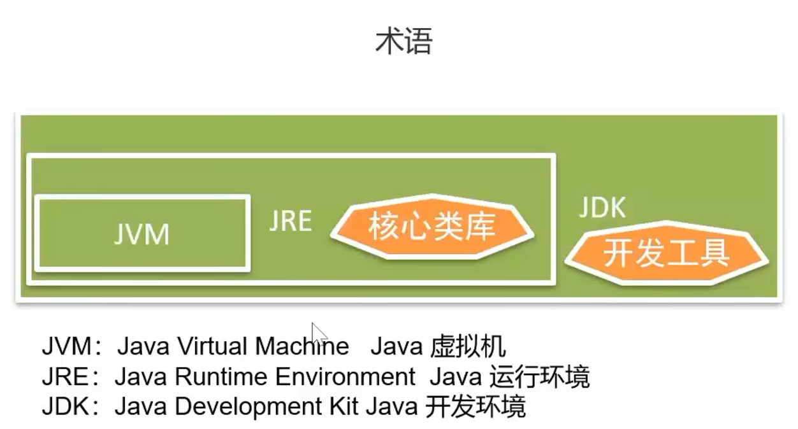
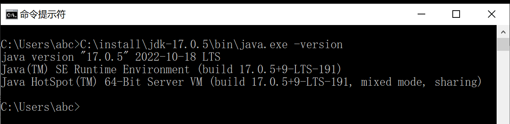
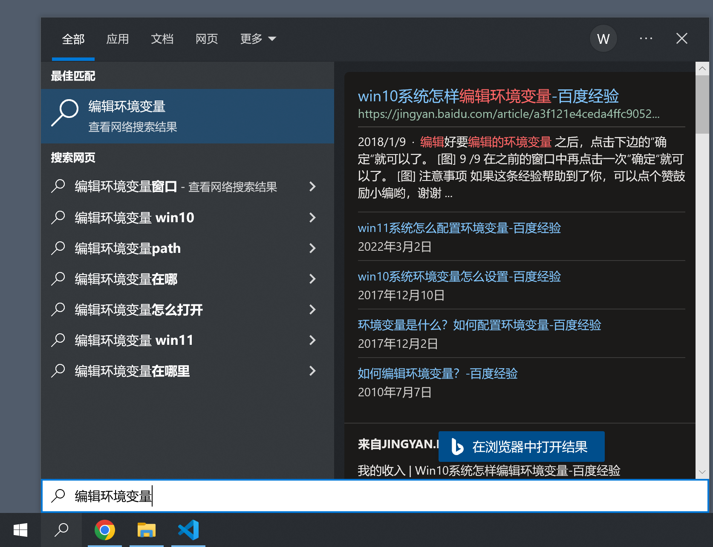
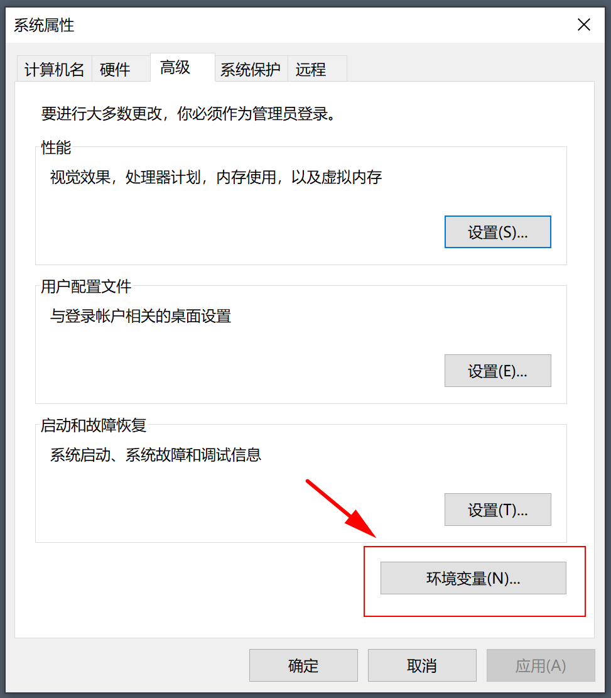
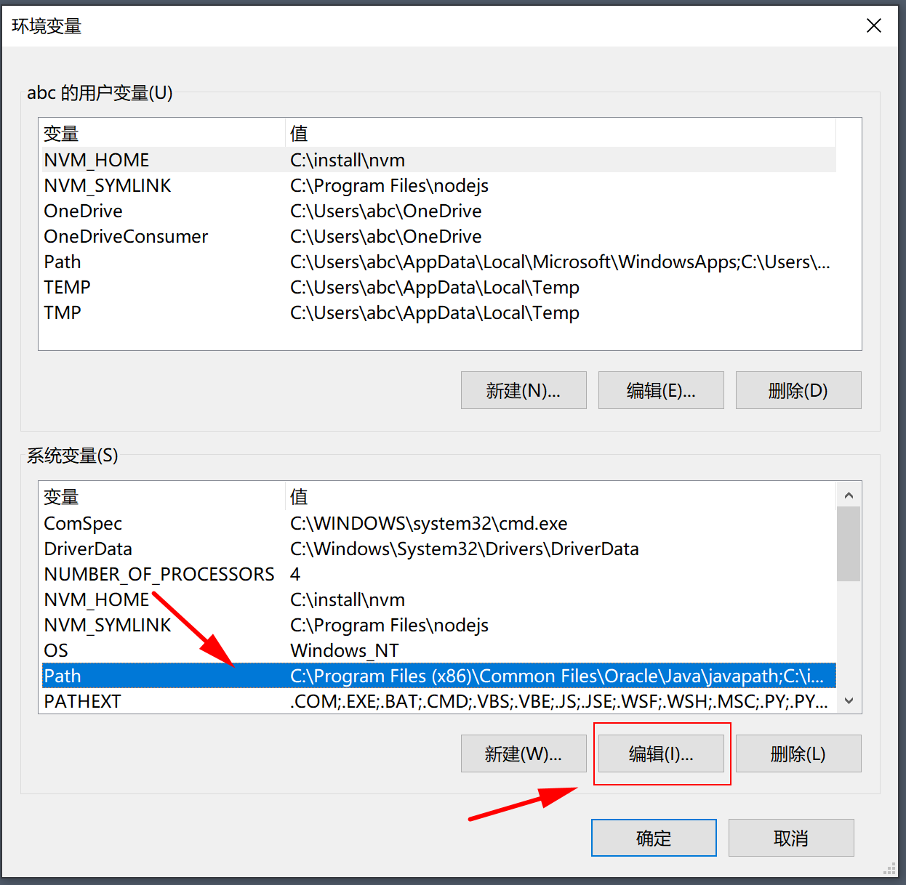
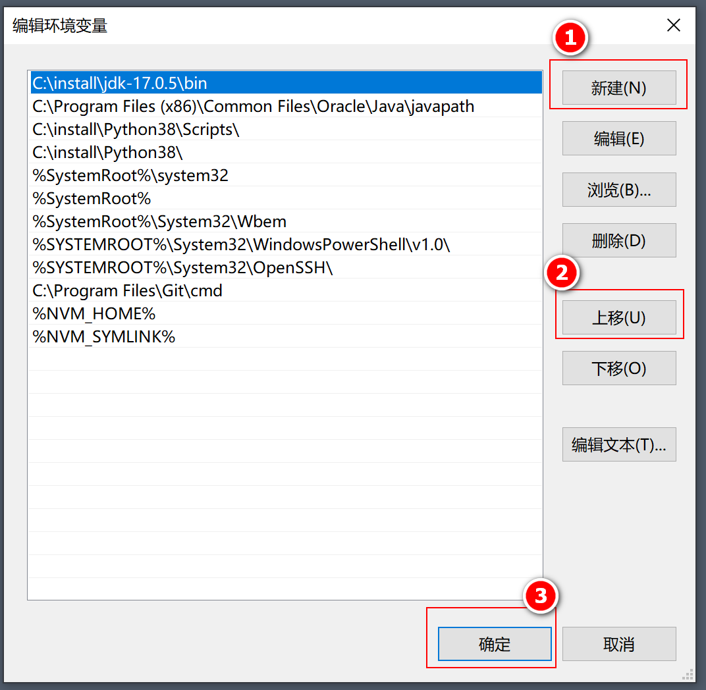
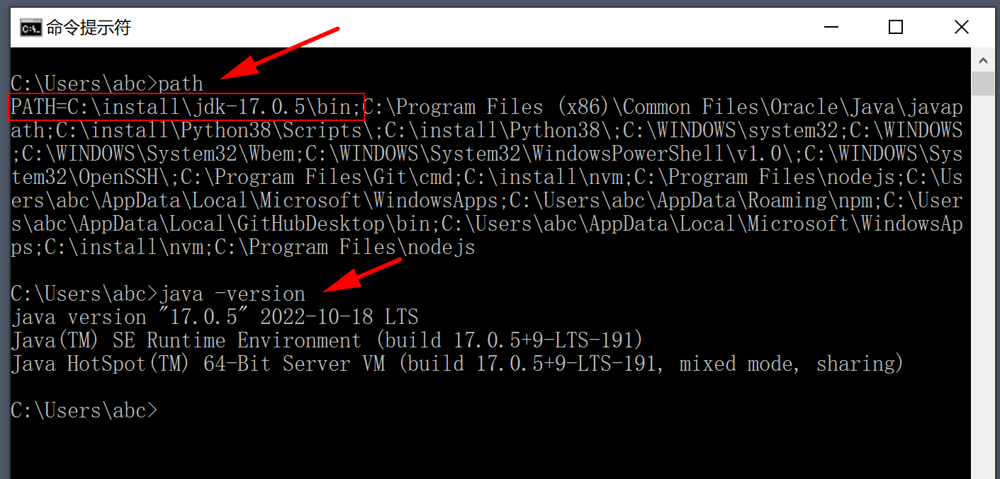
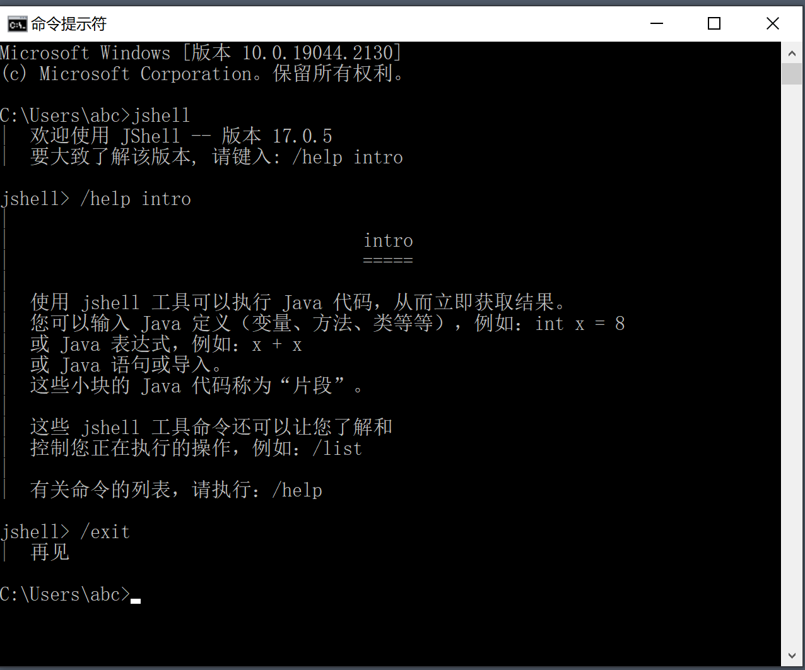

# 快速入门

## 1. 简介



## 2. 安装JDK

1.下载

* [JDK 17（windows, 解压版）]((https://download.oracle.com/java/17/latest/jdk-17_windows-x64_bin.zip))

2.解压

* C:\install\jdk-17.0.5

  ```txt
  C:\install\jdk-17.0.5
    bin
    conf
    include
    jmods
    legal
    lib
    LICENSE
    README
    release
  ```

3.验证

* 打开 CMD，执行 `C:\install\jdk-17.0.5\bin\java.exe -version`
* 

## 3. 配置环境变量

>将搜索路径 `C:\install\jdk-17.0.5\bin` 添加进 `path` 变量

1.设置

* 搜索
  * 
* 编辑（注意：以下三个对话框都要点击“确认”，以保存设置）
  * 
  * 
  * 

2.重启 CMD

* 

## 4. 第一行代码

JShell：

* （Java Shell），jdk9 引入的，交互式工具
* 

运行：

```text
jshell> System.out.println("hello, world")
hello, world
```

## 5. 第一份源码

源文件：（ Person.java ）

```java
class Person {
  public static void main(String[] args) {
    System.out.println("Hello, world. (你好)");
  }
}
```

编译：（ Person.java --> Person.class）

```text
PS C:\Users\abc\Desktop\repo\java_basic\assets\codes\01> javac .\Person.java
PS C:\Users\abc\Desktop\repo\java_basic\assets\codes\01> ls


    目录: C:\Users\abc\Desktop\repo\java_basic\assets\codes\01


Mode                 LastWriteTime         Length Name
----                 -------------         ------ ----
-a----        2022/10/19     20:33            418 Person.class
-a----        2022/10/19     20:29            107 Person.java
```

运行：（ Person.class）

```text
PS C:\Users\abc\Desktop\repo\java_basic\assets\codes\01> java Person
Hello, world. (浣犲ソ)
```

## 6. 乱码

统一为 UTF-8:

* 保存文件时使用 UTF-8 格式
* 编译时指定 UTF-8 格式： `javac -encoding utf-8 Person.java`